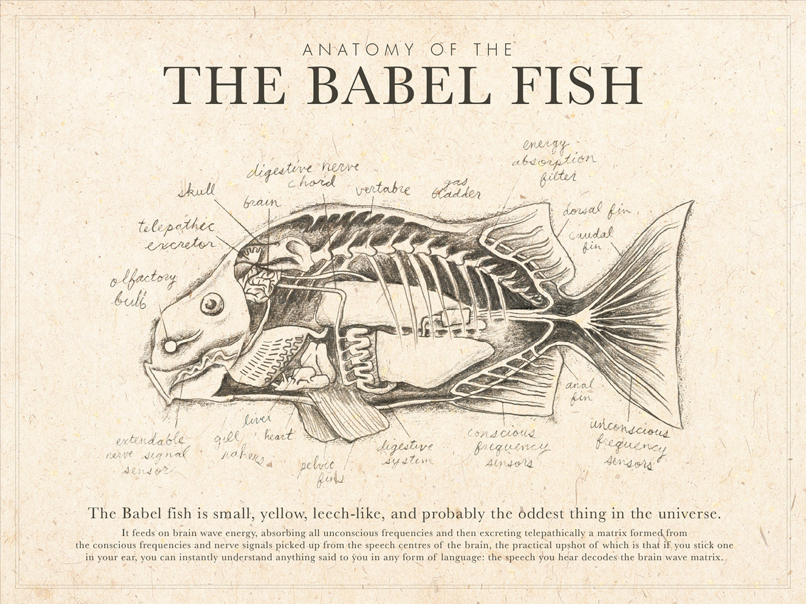

# Apresentação

Imagine a seguinte situação: após uma série de atualizações em seu manuscrito,
    com análises refeitas e resultados e discussões revisados, você percebe que
    um valor apresentado no meio do texto passou despercebido e permaneceu
    desatualizado. Esse tipo de situação não é difícil de imaginar,
    especialmente em um contexto no qual lidamos com grandes volumes de dados,
    análises cada vez mais complexas e múltiplas rodadas de revisão. Embora
    indesejável, é natural que algum detalhe acabe passando despercebido ao
    longo desse processo.

Nesta seção, apresento uma breve introdução a um tipo de documentação que pode
    ajudar a evitar situações como essa: os **documentos dinâmicos**.
    Especificamente, serão apresentados dois formatos de documentos dinâmicos
    que têm sido cada vez mais utilizados: **R Markdown** e **Quarto**. O foco
    será dado ao Quarto, por ser uma alternativa mais moderna e versátil, mas a
    lógica e o potencial de uso são semelhantes em ambos. A principal
    característica desses documentos é a possibilidade de integrar texto,
    código, dados e resultados em um único arquivo, permitindo que as análises e
    os elementos do documento sejam atualizados de forma consistente sempre que
    os dados ou códigos subjacentes forem modificados.  @ivimey-cookImplementingCodeReview2023 e @buckley_using_2025 apresentam algumas
    das vantagens do uso de documentos dinâmicos, como o Quarto e Rmarkdown,
    em estudos e projetos em Ecologia e Evolução. 

# O que são documentos dinâmicos

Os documentos dinâmicos são arquivos que contêm informações que podem ser
    atualizadas automaticamente à medida que os dados ou conteúdos que os
    compõem são modificados. Diferentemente dos documentos estáticos, eles podem
    integrar texto, dados, análises e visualizações de forma dinâmica, de modo
    que alterações nos dados de origem sejam refletidas automaticamente no
    documento final.
    
Outra característica que torna os documentos dinâmicos especialmente interessantes
    é a possibilidade de produção de documentos em linguagens que nós nem sabemos
    escrever. Por exemplo, não sei html, mas a produção de sites utilizando esta
    linguagem é possível através do uso de documentos dinâmicos com algumas 
    outras ferramentas adicionais que veremos mais adiante. 
    Para quem gosta da famosa **trilogia de cinco livros** do grande [Douglas Adams](https://en.wikipedia.org/wiki/Douglas_Adams), [O Guia do Mochileiro das Galáxias](https://en.wikipedia.org/wiki/The_Hitchhiker%27s_Guide_to_the_Galaxy), 
    tanto o Quarto quanto o Rmarkdown, juntamente com os pacotes `knitr`, `pandoc`,
    funcionam como o peixe Babel: mesmo que você não fale (neste caso, escreva) 
    uma dada língua, o peixe faz o trabalho de tradução em outra língua para você
    (@fig-peixebabel).
    A vantagem é que com o Quarto e Rmarkdown não há nenhuma necessidade de 
    introduzir nada desagradável na sua orelha.
    
```{r echo=FALSE,eval=T,fig.cap="Quarto e Rmarkdown são como um peixe Babel, ele faz você falar (e entender) uma linguagem mesmo não sabendo"}
#| label: fig-peixebabel

```

Tanto em Rmarkdown quanto em Quarto nós utilizaremos para escrita de texto, 
    principalmente o [Markdown](https://en.wikipedia.org/wiki/Markdown). Markdown
    é um tipo de linguagem de utilizada para estruturar textos simples usando
    símbolos comuns como `#`, `*`, entre outros. No contexto dessa disciplina
    utilizaremos essa linguagem principalmente para estruturar arquivos README
    e documentos dinâmicos.

## Quarto

Quarto é uma aplicação programática programa open source que possibilita a 
    produção de documentos dinâmicos que combinam códigos, resultados, 
    textos e vem cada vez mais 
    sendo utilizado para comunicação científica. Os documentos produzidos 
    com o Quarto tem alto potencial de reprodutibilidade (@buckley_using_2025) 
    e podem ser utilizados
    com diferentes propósitos, desde a simples produção de scripts de análises
    que combinam texto e pedaços de código até a produção de materiais como 
    sites, apresentações, dashboards, livros ou até mesmo artigos completos.
    
Nessa seção irei mostrar as funcionalidades básicas de um documento Quarto, como
    podem ser utilizados e suas principais características. Grande parte desse
    material é voltado para o uso básico do Quarto. Para maiores detalhes e 
    aprofundamento recomendo a leitura do capítulo sobre Quarto do livro 
    [R for Data Science](https://r4ds.hadley.nz/quarto.html).
    
## Rmarkdown

Rmarkdown é um tipo de arquivo utilizado para produção de documentos dinâmicos,
    tal como o Quarto, visto na seção anterior. Da mesma maneira, o Rmarkdown
    possibilita misturar texto e códigos em um mesmo documento, que pode ser 
    gerado em diferentes formatos (incluindo o html). A diferença entre Quarto
    e Rmarkdown está principalmente na maior versatilidade do primeiro em termos
    de diferentes linguagens de códigos que podem ser inseridos no documento, bem
    como a variedade de formatos de documentos que podem ser produzidos.
    


### Anatomia geral 

Um documento em quarto 

## Rmarkdown


# Slides da aula

Aqui você encontra os slides apresentados em aula sobre esse tópico

[Tela cheia 📺](slides.qmd)

```{=html}
<iframe class="slide-deck" src="slides.html" height="420" width="750" style="border: 1px solid #2e3846;"></iframe>
```
